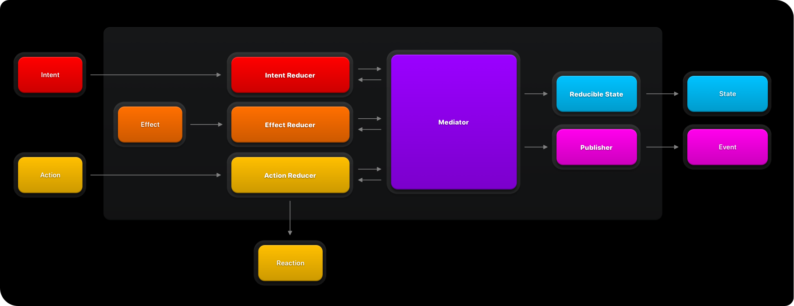

# SwiftMVI

[](https://github.com/xtro/SwiftMVI/actions/workflows/swift.yml)  [](https://github.com/apple/swift-package-manager)  

**SwiftMVI** is an open-source library of definitions and related extensions for modern swift application development.

## Overview

**SwiftMVI** provides the following features:
- Lightweight & scalable: Wide range of possible implementations from a single reducer to complex feature
- Able to publish events  
- A simple but very effective API bind your combine publishers to reducers and publishers.



The goal is a set of protocols for archiving structured data flow that takes minimal effort.
There are some important differences compared to other MVI implementations. 
First of all, in SwiftMVI state is a mutable ``ObservableObject``, therefore the reducers are not return anything not even an effect. The reducers can connect using the ``Processing`` protocol and its api. Your existing Combine publishers can be connected using ```.bind``` method and your implemented ``Feature`` can be inserted as A **Publisher** instance. in any process using ``EventReducer``.


### Reducibles
- **ImmutableState** Use this type when your State is immutable (struct, enum, etc...)
- **MutableState** Use this type when your State is mutable (class)

### Reducers
- **IntentReducer** An ability to process incomming intents from user.
- **AsyncIntentReducer** An async version of **IntentReducer**.
- **ActionReducer** An ability to process incomming action from itself or other reducers.
- **AsyncActionReducer** An async version of **ActionReducer**.
- **ReactionReducer** An ActionReducer that returns a Reaction.
- **AsyncReactionReducer** An async version of **ReactionReducer**.
- **EffectReducer** An ability to proccess incomming events from **Processing**.
- **AsyncEffectReducer** An async version of **EffectReducer**.

### Binding combine publisher or another feature to an:
- Intent ```bind(publisher){ .myIntent($0.value) }
- Action ```bind(publisher){ .myAction($0.value) }
- Effect ```bind(publisher){ .myEffect($0.value) }

## Installation
You can use Swift Package Manager to integrate the library by adding the following dependency in your Package.swift file or by adding directly within Xcode:

```swift
.package(url: "https://github.com/xtro/SwiftMVI.git", .upToNextMajor(from: "0.0.2"))
```

## Usage
- [Getting Started](Documentation/Getting_Started.md)
- [Example application](https://github.com/xtro/SwiftMVI-Examples)

## Sponsors
SwiftMVI is an MIT-licensed open-source project with its ongoing development made possible entirely by the support of awesome backers. If you'd like to join them, please consider sponsoring this development.

## Contributing
Pull requests are welcome. For major changes, please open an issue first to discuss what you would like to change.

Please make sure to update tests as appropriate.

## License
This library is released under the [MIT](https://choosealicense.com/licenses/mit/) license. See LICENSE for details.

